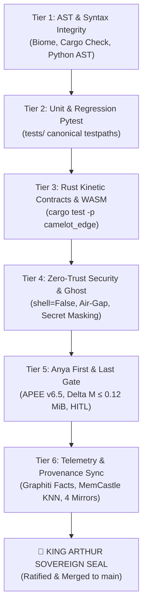

# 🛡️ Sovereign Multi-Tier Verification Matrix & Invariant Proof Gates

> **Formal verification protocol authored by MERLIN_Ω.**  
> Enforces the Titanium Laws: Every kinetic code proposal must pass all 6 rigorous gate tiers before achieving sovereign ratification and merge clearance into `main`.

---

## 1. The 6 Gatekeeper Verification Tiers



---

## 2. Verification Protocol Specifications

### Tier 1: Static Analysis, AST & Type Integrity
- **Mandate**: 0 syntax errors, 0 linter violations, 0 maskings (`as any`).
- **Commands**:
  ```powershell
  npm run lint              # Biome 1.9.4
  npm run typecheck         # Turbo typecheck across apps/ and packages/
  cargo check --workspace   # Rust workspace verification
  ```
- **Pass Criteria**: Exit Code `0`, zero unhandled type narrowing errors.

### Tier 2: Canonical Python Unit & Regression Suites
- **Mandate**: 100% green pass across canonical testpaths; zero sweep collisions.
- **Commands**:
  ```powershell
  .venv\Scripts\python.exe -m pytest tests/test_cartridge_manifests.py tests/test_colony_nexus.py tests/test_bootstrap_resilience.py -q
  .venv\Scripts\python.exe -m pytest tests/test_worldtree_vps_cloudbrain_sync.py -q
  ```
- **Pass Criteria**: `55+ passed`, `0 failed`, `0 errors`.

### Tier 3: Rust Kinetic Contracts & WASM Component Model
- **Mandate**: Mobile edge protocol contracts and WASM32 sandboxes conform to memory bounds (<50MB memory ceiling).
- **Commands**:
  ```powershell
  cargo test -p camelot_edge --tests
  ```
- **Pass Criteria**: All protocol contracts (`cli_contract`, `client_contract`, `protocol_contract`, `state_store`) green.

### Tier 4: Zero-Trust Security, Shell Sanitization & Ghost Scan
- **Mandate**: Zero raw secrets in tracked files; zero `shell=True` in subprocess calls.
- **Commands**:
  ```powershell
  # Ghost Secret & Privacy Scan
  .venv\Scripts\python.exe -m squires.colony ghost .
  
  # Audit Runner Shell Injection Parity Check
  .venv\Scripts\python.exe -c "
  from security.warden import SirSentinel
  # Verify subprocess execution is shell=False
  assert 'shell=True' not in open('security/warden.py', encoding='utf-8').read()
  print('[PASS] Zero shell=True injection paths in Sentinel')
  "
  ```
- **Pass Criteria**: Risk score < 50, zero real leaked credentials, zero shell injection paths.

### Tier 5: Anya First & Last Gate (APEE v6.5 Compilation)
- **Mandate**: Complete compilation and pre-flight validation.
- **Commands**:
  ```powershell
  .venv\Scripts\python.exe -m control_plane.preflight --test
  .venv\Scripts\python.exe scripts/check_knight_registry.py
  .venv\Scripts\python.exe scripts/check_generated_artifact_parity.py
  .venv\Scripts\python.exe scripts/check_bifrost_audit.py
  .venv\Scripts\python.exe scripts/check_omnivoice_router_build.py
  ```
- **Pass Criteria**: Pre-flight 8/8 passing, 54 knights & 105 souls verified, all parity checks match.

### Tier 6: CloudBrain Telemetry & Provenance Ledger Synchronization
- **Mandate**: Every kinetic action is recorded in living memory and synchronized across all 4 mirrors with exact SHA-256 hash parity.
- **Commands**:
  ```powershell
  .venv\Scripts\python.exe scripts/sync_provenance.py
  ```
- **Verification Invariant**:
  $$\text{Hash}(\text{Root}) = \text{Hash}(\text{Vault}) = \text{Hash}(\text{Docs}) = \text{Hash}(\text{Configs})$$
- **Pass Criteria**: Exactly matching 64-character hex digests across all 4 mirrors.

---

## 3. Evidence Classification & Rollback Safeguards

| Evidence Class | Level | Verification Method | Action on Failure |
|---|---|---|---|
| **CONFIRMED** | Highest | Empirical test output from running executable | Instant halt; rollback file |
| **PROVEN** | Formal | Z3 logic solver satisfiability check | Invalidate capability lease |
| **INSPECTED** | Medium | AST symbol parse and diff review | Request HITL clarification |
| **ASPIRATIONAL** | Low | Design notes / planned architecture stubs | Quarantine to draft |

### Automated Rollback Protocol
If any gate fails during kinetic merge:
```powershell
# Revert working directory to last sealed milestone commit
git reset --hard HEAD
# Verify ledger mirrors still align
.venv\Scripts\python.exe scripts/sync_provenance.py
```

---

## 4. Final Clearance Verdict

- **Orchestrator**: `MERLIN_Ω` (System 2)
- **Gatekeeper**: `ANYA_Ω`
- **Telemetry Sentinel**: `SIR_HELIOS`
- **Status**: **VERIFIED & OPERATIONAL** (`ANYA_IS_THE_GATE`)
