# 🛡️ Sovereign Production Acceptance Regime & Invariant Proof Gates

> **Formal verification protocol authored by MERLIN_Ω and ratified by ARTHUR_OMEGA.**  
> Enforces the absolute production acceptance regime across all 11 promotion tiers (P0–P11), formalizing contract vectors, deterministic decompression, 23-node lineage reconstruction, multi-tenant isolation, and the pure-proof first executable path.

---

## 1. The 11-Tier Production Promotion Matrix (P0 – P11)

Every proposal traversing the Sovereign Pipeline is evaluated against the sequential, non-bypassable P0–P11 promotion matrix:

| Tier | Gate Name | Responsible Knight | Verification Target & Invariant | Rejection Action |
|:---|:---|:---|:---|:---|
| **`P0`** | **Contract Vectors** | `SIR_CODEX` | Schema conformance, typed interfaces, and JSON/TOON vector validity | Immediate Drop |
| **`P1`** | **Deterministic Decompression** | `LADY_MNEMOSYNE` | Reproducible AST/semantic inflation without stochastic drift ($\Delta_{\text{drift}} = 0$) | Reject Nonce |
| **`P2`** | **23-Node Lineage Reconstruction** | `SIR_BORIS` | Full DAG ancestry trace verifying root origin to Cybertronia WorldTree | Broken Ancestry Halt |
| **`P3`** | **Persona-Boundary Enforcement** | `ANYA_Ω` | Strict persona capability leasing; no knight may issue authority beyond domain | Lease Revocation |
| **`P4`** | **Adaptive Cognitive Depth** | `MERLIN_Ω` | Test-Time Compute (TTC) budget bounding ($\le 32\text{K}$ tokens); DAG acyclicity | Graph Prune |
| **`P5`** | **Complexity & Safety Budgets** | `SIR_SENTINEL` | RSS Memory $\le 12\text{MB}$ in sandbox, cyclomatic complexity $\le 15$, risk tier classification | Quarantine |
| **`P6`** | **Sentinel Authority Check** | `SIR_SENTINEL` | Monotonic `AuthorityVector` dominance, zero-trust token presence, injection block | Capability Invalidation |
| **`P7`** | **Multi-Tenant Isolation** | `SIR_GHOST` | Strict cryptographic partitioning in `TenantReceiptChain`; zero cross-tenant leakage | Cryptographic Veto |
| **`P8`** | **Retreat & Replay Drills** | `SIR_DEBUG` | Idempotent re-execution yielding identical hash; atomic rollback without dirty state | Dirty State Rollback |
| **`P9`** | **Chaos & Fault Injection** | `SIMIAN_01` | Resilience against transient network drops, socket timeouts, and memory spikes | Fallback Circuit Trip |
| **`P10`** | **Sir Gideon 13-Gate Forensic Audit** | `SIR_GIDEON` | Formal 13-gate audit emitting signed `GideonVerdict` (`camelot-gideon-verdict/1`) | Gate Failure Block |
| **`P11`** | **Arthur Sovereign Crown Ratification** | `ARTHUR_OMEGA` | Human-in-the-loop Sovereign Resolution (`camelot-arthur-resolution/1`) & Merkle Commit | Golden Seal Refusal |

---

## 2. The First Executable Proof Path (Pure Proof / Zero Mutation)

The first executable path is deliberately narrow, deterministic, and isolated. It provides end-to-end mathematical verification of the execution pipeline without altering host state or granting external authorities:

```mermaid
flowchart TD
    NKG["1. νKG Crystal Input<br/>(Structured Vector Knowledge Node)"] --> DECOMP["2. Deterministic Decompression<br/>(Lossless AST / Semantic Inflation)"]
    DECOMP --> SYNTH["3. Sir Synthetos Reference Agent<br/>(Synthetic Isolated Sandbox Execution)"]
    SYNTH --> MERLIN["4. Merlin Architecture Delta<br/>(Graph Diff & Invariant Check)"]
    MERLIN --> ANYA["5. Anya Enterprise Impact<br/>(ΔM ≤ 0.12 MiB, Boundary Integrity)"]
    ANYA --> SAFETY["6. Complexity & Safety Measurement<br/>(Budget Scoring & Risk Tiering)"]
    SAFETY --> GIDEON["7. Sir Gideon 13-Gate Audit<br/>(Signed GideonVerdict)"]
    GIDEON --> ARTHUR["8. Arthur Sovereign Resolution<br/>(Crown Seal & Resolution ID)"]
    ARTHUR --> RECEIPT["9. Immutable Receipt<br/>(camelot-receipt/2 to Merkle Chain)"]
    RECEIPT --> UKG["10. Canonical UKG Commit<br/>(Position-Addressed WorldTree Resolution)"]

    style NKG fill:#1f2937,stroke:#D4AF37,stroke-width:2px
    style DECOMP fill:#1f2937,stroke:#60a5fa,stroke-width:2px
    style SYNTH fill:#1f2937,stroke:#a855f7,stroke-width:2px
    style MERLIN fill:#1f2937,stroke:#3b82f6,stroke-width:2px
    style ANYA fill:#1f2937,stroke:#ec4899,stroke-width:2px
    style SAFETY fill:#1f2937,stroke:#10b981,stroke-width:2px
    style GIDEON fill:#1f2937,stroke:#f59e0b,stroke-width:2px
    style ARTHUR fill:#1f2937,stroke:#ef4444,stroke-width:2px
    style RECEIPT fill:#1f2937,stroke:#D4AF37,stroke-width:3px
    style UKG fill:#1f2937,stroke:#22c55e,stroke-width:3px
```

### 🔒 Pure-Proof Boundary Invariants (Zero-Mutation Guarantee)
The first proof path strictly enforces:
1. **Zero Software Installation**: No `pip`, `npm`, `cargo`, or package manager invocation.
2. **Zero Host Mutation**: No working tree modifications, filesystem writes outside in-memory/isolated staging, or environment alterations.
3. **Zero Fabric Migration**: Database schemas, network topologies, and mesh links remain frozen.
4. **Zero Policy Changes**: Security thresholds, role matrices, and tenant boundaries are strictly read-only.
5. **Zero Persona-Issued Authority**: Neither Sir Synthetos nor any intermediate knight can grant capability leases; only the Arthur Crown Seal validates final resolution.

---

## 3. Detailed Acceptance Regime Specifications

### §1 Contract Vectors
- All input payloads must match their JSON Schema contract (`packages/contracts/*.schema.json`).
- Schema validation executes before any processing or memory allocation.

### §2 Deterministic Decompression
- Input νKG crystals are decompressed via deterministic expansion algorithms.
- Hash invariant:
  $$\text{SHA-256}(\text{Decompress}(\text{νKG})) \equiv \text{ExpectedASTHash}$$
- Non-deterministic fields (timestamps, random nonces) are segregated into metadata envelopes.

### §3 23-Node Lineage Reconstruction
- The pipeline reconstructs all 23 ancestor nodes in the dependency graph up to the Cybertronia root node (`a0a4bfb9-e847-4c38-be39-7aee398f0795`).
- Verifies zero dangling edges, circular loops, or broken cryptographic proofs.

### §4 Persona-Boundary Tests
- Validates that execution capabilities are strictly restricted to the caller's role defined in `vfs/roster.yaml`.
- Prevents cross-role capability escalation (e.g., builder knights calling governance runes).

### §5 Adaptive Cognitive Depth
- Bounded Test-Time Compute (TTC) algorithm monitors reasoning step depth and branching factor.
- Enforces strict cap: Maximum 32,000 reasoning tokens per task.

### §6 Complexity & Safety Measurement
- Enforces Rule 7 (0% Python/Node in performance hotpath).
- Sandbox memory ceiling: $<12\text{ MB}$ RSS.
- Execution timeout: $5.0\text{ seconds}$ maximum for bounded reference proofs.

### §7 Sentinel Authority Checks
- `AuthorityVector` dominance: $A_{\text{proposal}} \ge A_{\text{epoch}}$.
- Zero-trust token check: Validates presence of ephemeral capability leases.

### §8 Multi-Tenant Isolation
- Cryptographic Merkle chain partitioning: Every tenant maintains an isolated `TenantReceiptChain`.
- Cross-tenant lookups raise `TenantIsolationViolation`.

### §9 Retreat / Replay Drills
- Idempotency verification: Re-submitting the same proposal yields `IdempotencyDecision.REPLAY` with the exact historical receipt and zero state side-effects.

### §10 Chaos & Fault Injection
- Bounded fault injection tests simulate network drops, socket errors, and corrupted payloads, verifying clean failure classification (`PipelineStatus.ERROR` or `BLOCKED`).

---

## 4. Verification Evidence Classes & Clearance

| Evidence Class | Level | Verification Method | Action on Failure |
|:---|:---|:---|:---|
| **CONFIRMED** | Highest | Empirical test output from running executable | Instant halt; rollback |
| **PROVEN** | Formal | Z3 logic solver satisfiability check | Invalidate capability lease |
| **INSPECTED** | Medium | AST symbol parse and diff review | Request HITL clarification |
| **ASPIRATIONAL** | Low | Design notes / planned architecture stubs | Quarantine to draft |

- **Orchestrator**: `MERLIN_Ω` (System 2)
- **Gatekeeper**: `ANYA_Ω`
- **Telemetry Sentinel**: `SIR_HELIOS`
- **First Reference Pilot**: `SIR_SYNTHETOS`
- **Status**: **RATIFIED & FORMALIZED** (`ANYA_IS_THE_GATE`)
